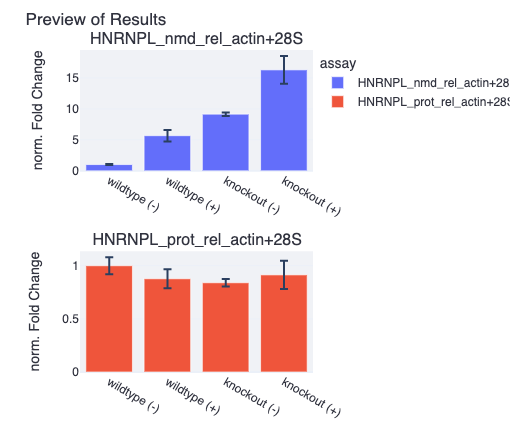
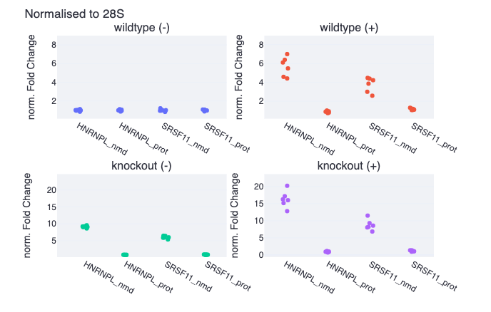

#  Qupid

##  Quantitative PCR Interface to Delta-Delta-Ct

This is `Qupid` the stand-alone web application for easy and fast Delta-Delta-Ct analysis of qPCR data provided by the  <a href = "https://github.com/NoahHenrikKleinschmidt/qpcr.git">qpcr python module</a>. 

### What does Qupid do?
`Qupid` allows you to automatically analyse your qPCR assays through established Delta-Delta-Ct analysis. Qupid is built as an intuitive and versatile graphical user interface to provide access to the core functionalities of the python `qpcr` module. Qupid supports a variety of differently structured `csv` or `excel` input datafiles and handles data reading, outlier filtering, delta-Ct and delta-delta-Ct computation, as well as instant data visualisation. Final results, as well as intermediary computations can be downloaded directly as `csv` files, while figures can be easily customised and saved as well. Thus, Qupid offers an easy-to-use, highly versatile, and automated method to greatly speed up your analysis of qPCR data.

### Is Qupid reliable and reproducible?
Qupid and the `qpcr` module have been tested on a variety of different datasets and have reproduced existing results from conventional Delta-Delta-Ct analyses that were manually performed in excel sheets. Hence, there are currently no known issues with either Qupid or `qpcr` with regard to reliability.

To ensure your Qupid results are reproducible, Qupid records all settings it uses to perform its computation and even plotting in a `Session Log`. You can (and should!) download the Session Log alongside with your results. The Session Log is in `json` format and can be opened in any conventional text editor. 

### How does it work?
It sounds a bit like you could just add some datafile of your's and Qupid will magically generate results for you. Well, not quite, but almost. In practice, you can upload just your one excel file and Qupid will pop out results for you, the shortest route is literally only 1 drag & drop and 3 button clicks! However, Qupid still needs some guidance to understand your data. Qupid makes use of so-called `decorators`, which are small text-markers that add meta-data to your qPCR assays and help Qupid interpret what it reads from your files. Decorators are a supported feature of the `qpcr` python module and you can learn more about decorators [from the documentation](https://noahhenrikkleinschmidt.github.io/qpcr/Parsers/Parsers.html#decorators). In practice, all you got to do is add the appropriate decorators to the appropriate cells within your datafile, and you are good to go.

## Getting Started
Start by checking out the [Getting Started Tutorial](https://github.com/NoahHenrikKleinschmidt/qpcr/blob/main/Examples/0_getting_started.ipynb) of the `qpcr` module to learn about the accepted types of input datafiles. Next, check out the [Decorator Tutorial](https://github.com/NoahHenrikKleinschmidt/qpcr/blob/main/Examples/8_decorating_datafiles.ipynb) to learn how to add decorators to your datafiles. After that, best try to analyse some file you have lying around to get some feeling of how Qupid works. The app will very dynamically adjust the types of input widgets it presents to the user to keep the interface as clean as possible, so don't worry if new fields appear after clicking on something, or if they vanish.

By the way, Qupid stores the settings it uses for its main computation and plotting, so you can iteratively upload different files and analyse them easily using the same parameters. 

> ## Example Results
> Here's a Preview Figure that Qupid automatically generates:
>
> By the way, the values plotted are, naturally, the final values from $2^{-\Delta\Delta Ct}$.  
>
> The entire process in Qupid from File Upload until this Figure was produced took around `43` seconds.
>
> 
>
> Well, the data was stored in separate files which made reading super easy and we used default settings for the main computation. 
>
> However, the figure below was generated from an analysis of just one single excel file containing data of six assays (two of them normalisers), and using some custom settings for the Delta-Ct value computation, plus a little figure adjustment. File preparation took around 25 seconds, Qupid setup took some 52 seconds. In total, `77` seconds from start to finish, results exportable in different formats for further analysis or visualisation. 
>
> 
>
> At this point it should be mentioned that these figures are actually pretty customisable. So even though they are intended just as "previews" they aim to be perfectly "lab-journal worthy".

#### Citation 

Kleinschmidt, N. (2022). Qupid - Quantitative PCR Interface to Delta-Delta-Ct, a web-application for swift Delta-Delta-Ct analysis of qPCR data. (Version 1.0.0) [Computer software]. https://github.com/NoahHenrikKleinschmidt/Qupid.git
